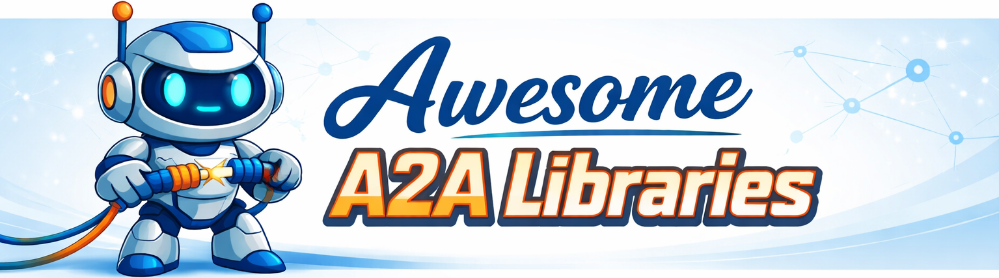

  <h1>Awesome Agent-to-Agent (A2A) Libraries</h1>

  

A curated list of **Agent-to-Agent (A2A) libraries and SDKs**, organized by **programming language**.

This list focuses **exclusively on code libraries** that implement or support the **Agent-to-Agent (A2A) protocol** for interoperable agent communication.

## What is A2A?

**Agent-to-Agent (A2A)** is an open protocol designed to enable **secure, peer-to-peer communication and collaboration between autonomous AI agents**, regardless of framework, runtime, or vendor. By standardizing the way agents exchange tasks, messages, and results, A2A allows developers to build **interoperable, multi-agent systems** capable of complex cross-application automation.

Key features of A2A include:

- **Framework-agnostic:** Works across different AI agent frameworks and programming languages.
- **Peer-to-peer communication:** Direct agent-to-agent messaging, with optional server-mediated routing.
- **Async-first design:** Supports long-running tasks and human-in-the-loop scenarios.
- **Modality-agnostic:** Handles text, files, forms, streams, and other data types.
- **Opaque execution:** Agents interact without exposing internal logic or proprietary tools.
- **Enterprise-ready:** Includes authentication, security, privacy, and monitoring considerations.

### Official Resources

- [Announcement Blog Post](https://developers.googleblog.com/en/a2a-a-new-era-of-agent-interoperability/) – Google's introduction to A2A.
- [GitHub Repository](https://github.com/a2aproject/A2A) – Source code, spec, and official samples.
- [Official Documentation](https://a2aproject.github.io/A2A) – Detailed technical reference and examples.

## Table of Contents

1. [Scope](#scope)  
2. [How to Read This List](#how-to-read-this-list)  
3. [Libraries by Language](#libraries-by-language)  
   - [Python](#python)  
   - [JavaScript / TypeScript](#javascript--typescript)  
   - [Java](#java)  
   - [Go](#go)  
   - [Rust](#rust)  
   - [C#](#c)  
4. [UI / Visual Orchestration for A2A](#ui--visual-orchestration-for-a2a)  
5. [Related Ecosystem](#related-ecosystem)  
6. [Contribution Guidelines](#contribution-guidelines)  
7. [License](#license)  

## Scope

**Included**
- A2A SDKs and client libraries  
- A2A servers, registries, and transports  
- Language-native agent libraries with A2A support  
- Utilities directly enabling A2A communication  

**Excluded**
- Non-A2A agent frameworks  
- SaaS platforms or hosted products  
- UI tools or prompt collections/templates  

For broader agent framework coverage see [awesome-ai-agents](https://github.com/e2b-dev/awesome-ai-agents) or [awesome-agent-papers](https://github.com/luo-junyu/Awesome-Agent-Papers) for new 📚 research on genAI & agents.

## Programming Languages

Currently, libraries for the following programming languages are supported:

  [ Python ]   [ JavaScript / TypeScript ]   [ Rust ] [ Java ] [ Go ] [ C# ]

            

## How to Read This List

Libraries are grouped **by programming language**. Each entry is described using a small set of consistent classifications focused on **A2A protocol responsibilities and usability**.

### Classification Dimensions

#### **A2A Capability**
What part of the Agent-to-Agent protocol the library implements:

- `Client` – initiates A2A tasks and conversations
- `Server` – receives, executes, and responds to A2A tasks
- `Client + Server` – full A2A node implementation
- `Spec / Schema` – protocol definitions, schemas, or validators
- `Tooling` – testing, debugging, CLI, or developer utilities for A2A

#### **Abstraction Level**
How opinionated or low-level the library is:

- `Low-level` – raw protocol primitives
- `Mid-level` – helpers and lifecycle abstractions
- `High-level` – batteries-included, minimal boilerplate

#### **Transport / Integration**
How agents communicate or integrate:

- `HTTP / REST`
- `WebSocket`
- `gRPC`
- `JSON-RPC`
- `Custom transport`
- `Pluggable transport`

#### **Maturity**
Current stability of the project:

- `Experimental` – early-stage, APIs may change
- `Usable` – stable enough for real projects
- `Production-ready` – battle-tested in production

#### **Tags**
Optional tags highlight notable characteristics:

- 🌐 Multi-agent
- 🔐 Auth / Security
- ⚡ High-performance
- 🧪 Research / Prototype
- 🏢 Enterprise-oriented
- 🔌 Framework integration
- 🧩 Extensible
- 📜 Spec-faithful

> Tip: Only include libraries that are **publicly available, actively maintained**, and relevant to **A2A** or **agent orchestration**.

## Libraries by Language

### Python

- **[Python A2A](https://github.com/a2aproject/a2a-python)**  

  
  
  

  The official Python SDK for the Agent2Agent (A2A) Protocol, enabling building A2A‑compliant agents and servers.  
  - **A2A Capability**: Client + Server
  - **Abstraction Level**: Mid-level
  - **Transport / Integration**: HTTP / REST, gRPC, JSON-RPC
  - **Maturity**: Production-ready
  - **Notes**: Official reference SDK with async support via `a2a-sdk` package and full protocol coverage.
  - **Tags**: 🌐 Multi-agent, 🏢 Enterprise-oriented, 📜 Spec-faithful

- **[Pydantic AI](https://github.com/pydantic/pydantic-ai)**  

  
  
  

  A Python agent framework with native A2A support via `to_a2a()` that can expose agents as A2A servers using FastA2A.  
  - **A2A Capability**: Client + Server
  - **Abstraction Level**: High-level
  - **Transport / Integration**: HTTP / REST
  - **Maturity**: Usable
  - **Notes**: Strong type-safety and FastAPI-style ergonomics; A2A is an integration, not the core focus.
  - **Tags**: 🌐 Multi-agent, 🔌 Framework integration, 🧩 Extensible

- **[FastA2A](https://github.com/pydantic/fasta2a)**  

  
  
  

  An ASGI-based A2A server implementation designed to expose agents as A2A endpoints.  
  - **A2A Capability**: Server
  - **Abstraction Level**: Mid-level
  - **Transport / Integration**: HTTP / REST
  - **Maturity**: Experimental
  - **Notes**: Tight FastAPI integration; often used together with Pydantic AI.
  - **Tags**: 🧪 Research / Prototype, 🔌 Framework integration

- **[cA2A](https://github.com/a2aproject/a2a-samples)** *(CLI utility)*  

  
  
  

  A simple CLI utility for interacting with A2A agents, useful for debugging or prototyping.  
  - **A2A Capability**: Tooling
  - **Abstraction Level**: High-level
  - **Transport / Integration**: HTTP / REST
  - **Maturity**: Experimental
  - **Notes**: Useful for manual inspection and protocol exploration.
  - **Tags**: 🧪 Research / Prototype

- **[CrewAI](https://github.com/crewAIInc/crewAI/)**  

  
  
  

  CrewAI is a multi-agent orchestration platform that supports A2A agent delegation, enabling agents to assign tasks to other agents and communicate via the A2A protocol. The following 📚 [docs](https://docs.crewai.com/en/learn/a2a-agent-delegation) showcase how A2A is implemented by crewAI.  
  - **A2A Capability**: Client + Server
  - **Abstraction Level**: High-level
  - **Transport / Integration**: Pluggable transport
  - **Maturity**: Production-ready
  - **Notes**: A2A is one of several supported delegation mechanisms.
  - **Tags**: 🌐 Multi-agent, 🏢 Enterprise-oriented, 🔌 Framework integration

- **[Protolink](https://github.com/nMaroulis/protolink)**

  
  
  

  A lightweight library to build autonomous agents, automating the transport, LLM & tool integration.  
  - **A2A Capability**: Client + Server, Spec / Schema
  - **Abstraction Level**: High-level
  - **Transport / Integration**: HTTP / REST, WebSocket, gRPC, JSON-RPC, Custom transport
  - **Maturity**: Experimental
  - **Notes**: Optimized for rapid experimentation, includes abstractions for each A2A component (discovery, messaging, session management) and LLM & tooling.
  - **Tags**: 🧪 Research / Prototype, 🧩 Extensible, 🌐 Multi-agent, ✅ Beginner-friendly

---

### JavaScript / TypeScript

- **[A2A JS SDK](https://github.com/a2aproject/a2a-js)**  

  
  
  

  Official JavaScript/TypeScript SDK for A2A Protocol, enabling agent servers and clients in Node.js/TS projects.  
  - **A2A Capability:** Client + Server
  - **Abstraction Level:** Mid-level
  - **Transport / Integration:** HTTP / REST, gRPC, JSON-RPC
  - **Maturity:** Production-ready
  - **Notes:** Official JS/TS reference SDK.
  - **Tags:** 🌐 Multi-agent, 📜 Spec-faithful

---

### Java

- **[A2A Java SDK](https://github.com/a2aproject/a2a-java)**  

  
  
  

  Official Java SDK for building A2A‑compliant agents and servers.  
  - **A2A Capability**: Client + Server
  - **Abstraction Level**: Mid-level
  - **Transport / Integration**: HTTP / REST, gRPC, JSON-RPC
  - **Maturity**: Production-ready
  - **Notes**: Official reference implementation for the JVM ecosystem.
  - **Tags**: 🌐 Multi-agent, 📜 Spec-faithful

---

### Go

- **[A2A Go SDK](https://github.com/a2aproject/a2a-go)**  

  
  
  

  Official Go SDK for implementing A2A servers and clients.  
  - **A2A Capability**: Client + Server
  - **Abstraction Level**: Mid-level
  - **Transport / Integration**: HTTP / REST, gRPC, JSON-RPC
  - **Maturity**: Production-ready
  - **Notes**: Includes end-to-end examples for both client and server implementations.
  - **Tags**: 🌐 Multi-agent, 📜 Spec-faithful

- **[tRPC-A2A-Go](https://github.com/trpc-group/trpc-a2a-go)** *(community implementation)*  

  
  
  

  Community Go implementation that follows the A2A protocol with examples and utilities.  
  - **A2A Capability**: Client + Server
  - **Abstraction Level**: Mid-level
  - **Transport / Integration**: HTTP / REST
  - **Maturity**: Experimental
  - **Notes**: Includes session management and authentication helpers beyond the core spec.
  - **Tags**: 🧪 Research / Prototype, 🧩 Extensible

---

### Rust

- **[a2a-rs](https://github.com/EmilLindfors/a2a-rs)**  

  
  
  

  Rust implementation of the A2A protocol with examples and production-like use cases.  
  - **A2A Capability**: Client + Server
  - **Abstraction Level**: Low-level
  - **Transport / Integration**: HTTP / REST, WebSocket
  - **Maturity**: Experimental
  - **Notes**: Focuses on correctness and performance; suitable for systems-level integrations.
  - **Tags**: 🧪 Research / Prototype, ⚡ High-performance

---

### C#

- **[A2A .NET SDK](https://github.com/a2aproject/a2a-dotnet)**  

  
  
  

  Official .NET implementation of the A2A Protocol for C# applications.  
  - **A2A Capability**: Client + Server
  - **Abstraction Level**: Mid-level
  - **Transport / Integration**: HTTP / REST, gRPC, JSON-RPC
  - **Maturity**: Production-ready
  - **Notes**: Designed for .NET and ASP.NET Core applications with support for modern .NET features.
  - **Tags**: 🌐 Multi-agent, 📜 Spec-faithful

---

## UI / Visual Orchestration for A2A

At the time of writing, there are **no visual or low-code tools that natively support the Agent-to-Agent (A2A) protocol**.

Existing visual agent builders and workflow tools rely on **centralized orchestration** and do not implement A2A peer-to-peer semantics.
  - **[n8n](https://github.com/n8n-io/n8n)** – Visual workflow automation with centralized orchestration; node-based flows using HTTP calls, not peer-to-peer agents.
  - **[Flowise](https://github.com/FlowiseAI/Flowise)** – Visual agent and chain builder on top of LangChain/LangGraph; centralized orchestration with no native agent interoperability.
  - **[LangFlow](https://github.com/langflow-ai/langflow)** – Visual LLM workflow designer focused on prompt and chain composition rather than autonomous agents.
  - **[AutoGen Studio](https://github.com/microsoft/autogen)** – UI for orchestrating AutoGen agents using a coordinator-based model; lacks protocol-level interoperability.
  - **[CrewAI Studio](https://github.com/strnad/CrewAI-Studio)** – Visual agent orchestration built around a manager–worker model with centrally planned task execution.

Projects exploring agent-generated UI (e.g. A2UI) or visual workflows may integrate with A2A in the future, but **no A2A-native UI tooling exists yet**.

This section will be updated as the ecosystem evolves.

## Related Ecosystem

- **[A2A Protocol Specification](https://developers.googleblog.com/en/a2a-a-new-era-of-agent-interoperability/)** – Official protocol documentation  
- **[awesome-agents / awesome-ai-agents](https://github.com/e2b-dev/awesome-ai-agents)** – Broader agent framework lists  
- Multi-agent orchestration frameworks may integrate with A2A but are listed elsewhere  

## Contribution Guidelines

Contributions are welcome! Please follow these guidelines:  
- Only add **actively maintained** libraries  
- Include **links, roles, model type, and maturity**  
- Submit via pull requests with descriptive information  

See full guidelines: [CONTRIBUTING.md](CONTRIBUTING.md)

## License

This list is released under the **MIT License**.
